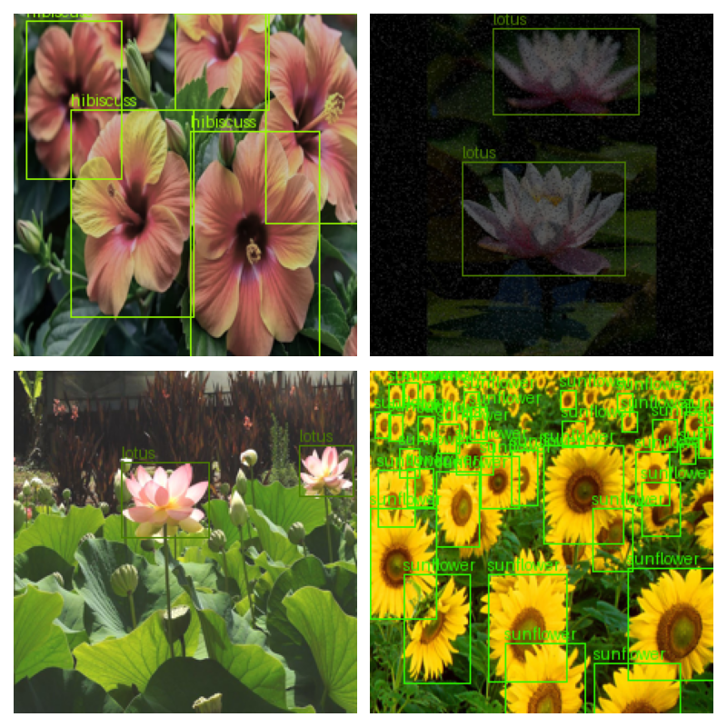

# <div align="center">Flower Detection Model</div>
<p align="center">
  
</p>

---
This repository contains an object detection model based on the YOLO architecture designed to detect five types of flowers:

    1. Lotus
    2. Sunflower
    3. Marigold
    4. Rose
    4. Hibiscuss

The model has been trained on a custom dataset and is capable of detecting these flowers in images with high accuracy.

## [Content]
1. [Description](#description)   
2. [Installation](#installation)
3. [Dataset](#dataset)  
4. [Training](#training)
5. [Result](#result)

---
## [Description]

This project implements a YOLO-based detection model tailored for flower detection. The model predicts bounding boxes and class probabilities for each grid cell, allowing it to locate and classify flowers in an image. The five target classes are lotus, sunflower, marigold, rose, and hibiscuss.
')

### Features
    1. Custom YOLO Architecture: Adapted for detecting five flower classes.
    2. Data Augmentation: Utilizes random horizontal/vertical flips, rotation, and Gaussian blur for robust training.
    3. Custom Loss Function: Incorporates localization, objectness, and classification losses.
    4. Evaluation Metrics: Calculates mAP and accuracy during validation.
    5. Easy Training: Scripts for training and evaluating the model are provided.

## [Installation]
1.Clone the Repository
```python
https://github.com/Infinity027/flower_detection_model.git
cd flower_detection_model
```
2. Install Dependencies
```python
pip install -r requirements.txt
```
Typical dependencies include:

    1. Python 3.8+
    2. PyTorch
    3. torchvision
    4. torchmetrics
    5. tqdm
    6. matplotlib
    7. Other utilities (e.g., Pillow)
    
## [Dataset]

The dataset consists of images and corresponding labels for the five flower classes.

    Images: RGB images (optionally with extra spectral channels, converted as needed).
    Labels: Each label file contains the object annotations in YOLO format: [class_id, x_center, y_center, width, height] with normalized coordinates.

Organize your dataset as follows:

    data/
     ├── images/
     │    ├── train/
     │    └── val/
     └── labels/
          ├── train/
          └── val/

## [Training]
To train the model, run the training script with appropriate arguments. For example:
```python
python train.py --yaml_path data/flowers.yaml --epochs 100 --batch_size 16 --lr 0.001
```
  Arguments:

    1. --data_dir: Path to the dataset directory.
    2. --epochs: Number of training epochs.
    3. --batch_size: Batch size.
    4. --lr: Learning rate.
    5. Other options include NMS thresholds, resume training, etc.
    
## [Result]

Below are some sample results:


